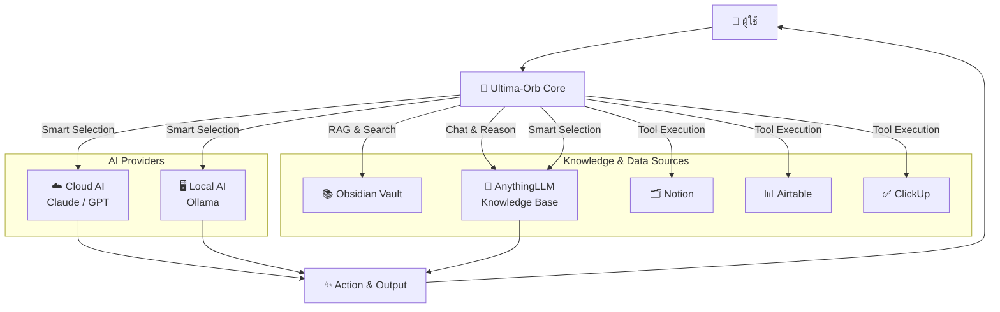
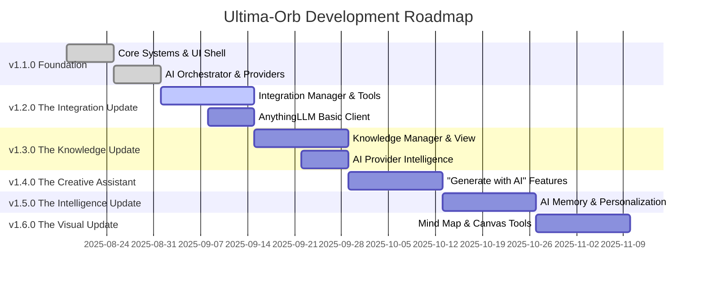

# 🔮 Ultima-Orb - Smart AI Assistant for Obsidian

### ศูนย์บัญชาการ AI ไฮบริดสำหรับ Obsidian

**Ultima-Orb** คือปลั๊กอินที่เปลี่ยน Obsidian ของคุณให้กลายเป็นศูนย์บัญชาการ AI อัจฉริยะ ที่สามารถ **คิด, สร้าง, จัดการ, และเรียนรู้** จากองค์ความรู้ทั้งหมดของคุณได้อย่างสมบูรณ์ โดยการหลอมรวมขุมพลังของ AI จากหลายแหล่ง ไม่ว่าจะเป็น **Cloud Models (Claude, GPT), Local Models (Ollama),** และ **Personal Knowledge Models (AnythingLLM)** เข้าไว้ด้วยกัน

---

## 🎯 วิสัยทัศน์และหลักการสำคัญ

### 🔒 **ความเป็นส่วนตัวต้องมาก่อน (Privacy-First)**
ข้อมูลความรู้ส่วนตัวของคุณจะถูกประมวลผลในเครื่องผ่าน AnythingLLM และ Local Models เป็นหลัก คุณคือผู้ควบคุมข้อมูลทั้งหมด 100%

### 🌐 **ศูนย์บัญชาการองค์ความรู้ (Knowledge Command Center)**
ทลายกำแพงระหว่างแอปพลิเคชัน สั่งการและค้นหาข้อมูลข้าม Obsidian, Notion, ClickUp, Airtable และฐานความรู้ส่วนตัวของคุณได้จากที่เดียว

### 🤖 **หน่วยประมวลผล AI อัจฉริยะ (Intelligent AI Core)**
สถาปัตยกรรมแบบไฮบริดที่ยืดหยุ่น สามารถเลือกใช้ AI ที่เหมาะสมกับงานที่สุดโดยอัตโนมัติ โดยไม่ถูกผูกมัดกับผู้ให้บริการรายใดรายหนึ่ง

---

## 🚀 ความสามารถหลัก

| ด้านความสามารถ | ความสามารถของ Ultima-Orb |
| :--- | :--- |
| **Hybrid AI Core** | ผสานการทำงานของ Claude, GPT, Ollama, และ Gemini พร้อมระบบเลือก Provider อัจฉริยะ |
| **Personal Knowledge Hub** | เชื่อมต่อกับ AnythingLLM เพื่อสร้างฐานความรู้ที่สามารถ "สนทนา" และ "ให้เหตุผล" จากเอกสารของคุณได้ |
| **Universal Tooling System**| ควบคุมและสั่งงานบริการภายนอกผ่านชุดเครื่องมือกว่า 42+ รายการ (Notion, Airtable, ClickUp, etc.) |
| **Creative Assistant Mode**| ให้ AI ช่วยสร้างส่วนประกอบที่ซับซ้อน เช่น System Prompts และ Tool Templates |
| **Autonomous Agent Mode**| AI Agent ที่สามารถวางแผนและใช้เครื่องมือต่างๆ เพื่อทำงานที่ซับซ้อนให้สำเร็จได้ด้วยตัวเอง |

---

## 💡 ตัวอย่างการใช้งานจริง

### 💬 **การถามและค้นหา**
> "ช่วยสรุปโปรเจกต์ 'Q4 Marketing' จาก Notion, หางานที่ยังค้างอยู่ใน ClickUp, และตรวจสอบเอกสาร Research ที่เกี่ยวข้องจาก Knowledge Base ของเราให้หน่อย"

### 📝 **การสร้างและจัดการ**
> "สร้างแผนโปรเจกต์ใหม่ใน Notion โดยใช้เทมเพลต 'Project Brief', สร้าง Task เริ่มต้นใน ClickUp, และประกาศการเริ่มต้นโปรเจกต์ใน Slack"

---

## 🏗️ สถาปัตยกรรม: The Hybrid AI Command Center



---

## ⚡ ทำไมต้อง Ultima-Orb?

| คุณสมบัติ | เครื่องมืออื่น | 🔮 Ultima-Orb |
| :--- | :--- | :--- |
| **แหล่งความรู้** | ข้อมูลแยกขาด ทำงานได้แค่ในแอปของตัวเอง | **เชื่อมถึงกันทั้งหมด** ทั้ง Vault, Knowledge Base, และ External Apps |
| **ความสามารถ AI** | ถูกจำกัดแค่โมเดลเดียว หรือ RAG ทั่วไป | **Hybrid AI Core** เลือกใช้ AI ที่ดีที่สุดสำหรับงานนั้นๆ โดยอัตโนมัติ |
| **ระบบอัตโนมัติ** | ทำได้แค่ส่งออกข้อความธรรมดา | **Active Agent** ที่ใช้เครื่องมือทำงานจริง เช่น สร้าง Task, อัปเดต Database |

---

## 🛠️ การเริ่มต้นใช้งาน

### สำหรับผู้ใช้ทั่วไป

1. ติดตั้ง **Ultima-Orb** จาก Community Plugins ในโปรแกรม Obsidian
2. ไปที่ `Settings → Ultima Orb`
3. เพิ่ม API Keys สำหรับ Cloud AI ที่คุณต้องการในแท็บ `AI Providers`
4. (ทางเลือก) ไปที่แท็บ `Integrations` เพื่อเชื่อมต่อกับ Notion, Airtable, หรือ ClickUp
5. (ทางเลือก) ไปที่แท็บ `Knowledge Base` เพื่อตั้งค่าการเชื่อมต่อกับ **AnythingLLM**

### สำหรับนักพัฒนา

#### ข้อกำหนด
- Node.js (v18+)
- npm หรือ yarn
- Obsidian Desktop App

#### การติดตั้ง

```bash
# Clone repository
git clone <repository-url>
cd ultima-orb

# ติดตั้ง dependencies
npm install

# เริ่มโหมดพัฒนา
npm run dev
```

> **หมายเหตุ:** สคริปต์จะทำการ build และคัดลอกไฟล์ไปยังโฟลเดอร์ `.test-vault` พร้อมเฝ้าดูการเปลี่ยนแปลงอัตโนมัติ

#### การทดสอบ
1. ใน Obsidian, เปิด `.test-vault` ขึ้นมา
2. เปิดใช้งาน **Ultima-Orb** ใน `Community plugins`
3. เริ่มทดสอบฟีเจอร์ต่างๆ

---

## 🔗 การเชื่อมต่อและระบบเครื่องมือ (Integrations & Tooling)

**Ultima-Orb** เชื่อมต่อกับเครื่องมือภายนอกผ่าน Official API ของแต่ละบริการ เพื่อให้คุณสามารถสั่งงานได้อย่างปลอดภัยและเต็มประสิทธิภาพผ่านระบบ **Tooling System**

### ตัวอย่าง: เชื่อม Ultima-Orb กับ Notion

1. **สร้าง Integration ใน Notion:**
   - ไปที่ [www.notion.so/my-integrations](https://www.notion.so/my-integrations) แล้วสร้าง Integration ใหม่
   - คัดลอก "Internal Integration Secret" (API Key) ที่ได้มา

2. **แชร์ Database ให้ Integration:**
   - ไปที่หน้า Database ที่คุณต้องการเชื่อมต่อ กด `...` → `Add connections` แล้วเลือก Integration ที่คุณเพิ่งสร้าง

3. **เพิ่มการเชื่อมต่อใน Ultima-Orb:**
   - ไปที่ `Settings → Ultima Orb → Integrations`
   - ในส่วนของ Notion, กด "Add Credential" แล้วนำ API Key จากขั้นตอนที่ 1 มากรอก

4. **เริ่มใช้งาน:** เมื่อเชื่อมต่อสำเร็จ Agent และ AI ของเราจะสามารถใช้ Tool ทั้ง 13 รายการของ Notion ได้ทันที

---

## 📋 แผนการพัฒนา (Roadmap)



---

## 🤝 การมีส่วนร่วม (Contributing)

เรายินดีต้อนรับการมีส่วนร่วมทุกรูปแบบผ่านทาง GitHub Repository ของเรา

- 📚 **Repository:** [GitHub Repository](https://github.com/dollawatt/ultima-orb)
- 🐛 **แจ้งปัญหา (Issues):** [GitHub Issues](https://github.com/dollawatt/ultima-orb/issues)
- 💬 **พูดคุย (Community):** [GitHub Discussions](https://github.com/dollawatt/ultima-orb/discussions) หรือ [Obsidian Forum](https://forum.obsidian.md/)

### การพัฒนา

1. Fork repository
2. สร้าง feature branch (`git checkout -b feature/amazing-feature`)
3. Commit การเปลี่ยนแปลง (`git commit -m 'Add some amazing feature'`)
4. Push ไปยัง branch (`git push origin feature/amazing-feature`)
5. เปิด Pull Request

---

## 📄 สัญญาอนุญาต (License)

โปรเจกต์นี้อยู่ภายใต้สัญญาอนุญาตแบบ **MIT License** ดูรายละเอียดเพิ่มเติมได้ในไฟล์ `LICENSE`

---

## 🙏 การสนับสนุน

หากคุณชอบโปรเจกต์นี้ กรุณาให้ดาว (⭐) และสนับสนุนเราได้ที่:

- ☕ [Buy Me a Coffee](https://buymeacoffee.com/dollawatt)
- 💰 [GitHub Sponsors](https://github.com/sponsors/dollawatt)

---

## 📞 ติดต่อ

- 👨‍💻 **ผู้พัฒนา:** Dollawatt Chidjai
- 🌐 **GitHub:** [@dollawatt](https://github.com/dollawatt)
- 📧 **Email:** [your-email@example.com]

---

**🚀 พร้อมที่จะปฏิวัติการจัดการความรู้ของคุณแล้วหรือยัง? ติดตามการพัฒนาของเราได้ที่ GitHub!**